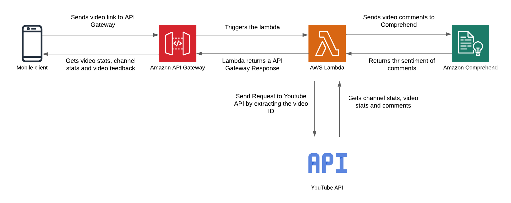

# Youtube-Analytics-Mini-App

## Overview
The YouTube Analytics Mini is an Android application that provides users with the overall feedback of the YouTube video/ One can check via the video link to see the likes views, channel details, and sentiment of the YouTube video comments by the audience. The application uses AWS Lambda for the backend whereas the Android app is the end user's front end.

## Codes-
The code of the project can be viewed here-
1. Lambda Function code- https://github.com/Antriksh1234/Youtube-Analytics-Mini---Lambda
2. Android app- https://github.com/Antriksh1234/Youtube-Analytics-Mini---Android

## Project Architecture-

## Tools and tech used-
1. Java
2. XML
3. Android
4. Go
5. AWS Lambda
6. AWS Comprehend
7. AWS API Gateway
8. Youtube API
